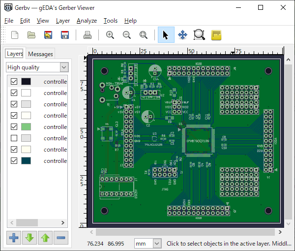

[日本語](./README_jp.md)  

#### NOTE: Please do not use gerbv-2.7.0 because it is vulnerable [TALOS-2021-1415](https://talosintelligence.com/vulnerability_reports/TALOS-2021-1415), [TALOS-2021-1416](https://talosintelligence.com/vulnerability_reports/TALOS-2021-1416). Please use [gerbv-2.10.0](https://github.com/kitanokitsune/gervb_for_win_multilanguage/releases) instead.

# gerbv 2.7.0 for Windows
Windows port of gEDA gerber viewer
  


## Overview
This is a set of executables for MS-Windows that apply the following bug fixes to the original [gerbv 2.7.0](https://sourceforge.net/projects/gerbv/files/gerbv/gerbv-2.7.0/ ) .

+ [(Bug Report #258) Gerbv routing command support](https://sourceforge.net/p/gerbv/bugs/258/ )
+ [#83 Crash may occur on opening/saveing files](https://sourceforge.net/p/gerbv/patches/83/ )
+ [#82 Spin control will not accept the keyboard input](https://sourceforge.net/p/gerbv/patches/82/ )
+ [#81 Fix casting pointer to different size integer](https://sourceforge.net/p/gerbv/patches/81/ )
+ [#80 Compilation error fix for duplicate enum variables](https://sourceforge.net/p/gerbv/patches/80/ )
+ [#79 Allow non-ASCII install path on MS-Windows](https://sourceforge.net/p/gerbv/patches/79/ )
+ [#78 Open non-ASCII filename](https://sourceforge.net/p/gerbv/patches/78/ )
+ [#77 Fix double-freeing memory](https://sourceforge.net/p/gerbv/patches/77/ )
+ [#76 Allow 'gerbv foo.gvp' to act like 'gerbv -p foo.gvp' was specified](https://sourceforge.net/p/gerbv/patches/76/ )
+ [#75 Fix bounding box calculation for slots](https://sourceforge.net/p/gerbv/patches/75/ )


Executables in [32bit version ](./32bit) and [64bit version](./64bit) are available.
They are built with msys64 (mingw-w64).  


## Install
Copy the contents of [32bit](./32bit) or [64bit](./64bit) into an arbitrary directory.  
Please keep the positional relation between **bin**, **lib** and **share** as below.  
```TEXT
<install_dir> --+-- bin\ （gerbv.exe is here）
                |
                +-- etc\
                |
                +-- lib\
                |
                +-- share\
```  


## Localization
Create [your language file (.po)](./src/po), then convert it to **gerbv.mo** and place it in  **`share\locale\<your_lang>\LC_MESSAGES\`**.  Please see **GNU gettext** document for details.


## Source Code
The patched source files are in [src](./src) directory.  

This package is based on the source code which was obtained from **git.geda-project.org**.  
[http://git.geda-project.org/gerbv/tree/?id=b5f1eacd798f327ab319af939f89031db4b7c10a](http://git.geda-project.org/gerbv/tree/?id=b5f1eacd798f327ab319af939f89031db4b7c10a)  


## License
This software is distributed under GPLv2.
```TEXT
Copyright (C) 2020 kitanokitsune

This program is free software; you can redistribute it and/or
modify it under the terms of the GNU General Public License
as published by the Free Software Foundation; either version 2
of the License, or (at your option) any later version.

This program is distributed in the hope that it will be useful,
but WITHOUT ANY WARRANTY; without even the implied warranty of
MERCHANTABILITY or FITNESS FOR A PARTICULAR PURPOSE.  See the
GNU General Public License for more details.

You should have received a copy of the GNU General Public License
along with this program; if not, write to the Free Software
Foundation, Inc., 51 Franklin Street, Fifth Floor, Boston, MA  02110-1301, USA.
```
---
kitanokitsune / 北乃きつね
